Step 1 — Prepare a Web Server.
Lunch an ec2 instance to serve as the Redhat web server. Create 3 volumes (10GB each) in the same AZ to be attached to Web Server EC2 instance.
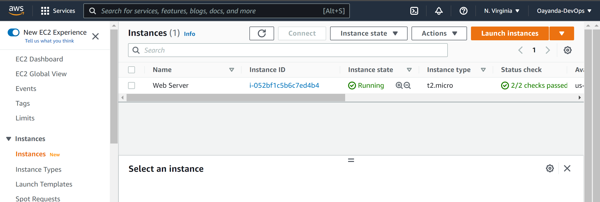

Create the 3 EBS Volumes in the same availablity zone(AZ).
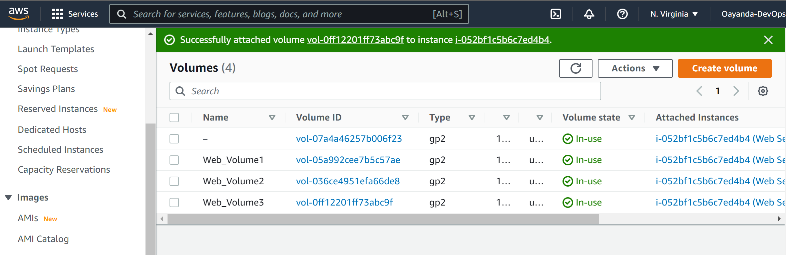

Attach the 3 ebs volumes to the ec2 instance.
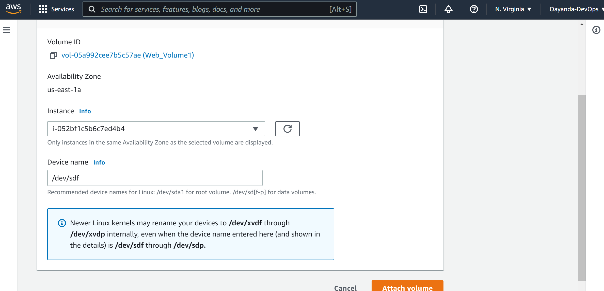

Verify all volumes are attached to the AWS ec2 instance.
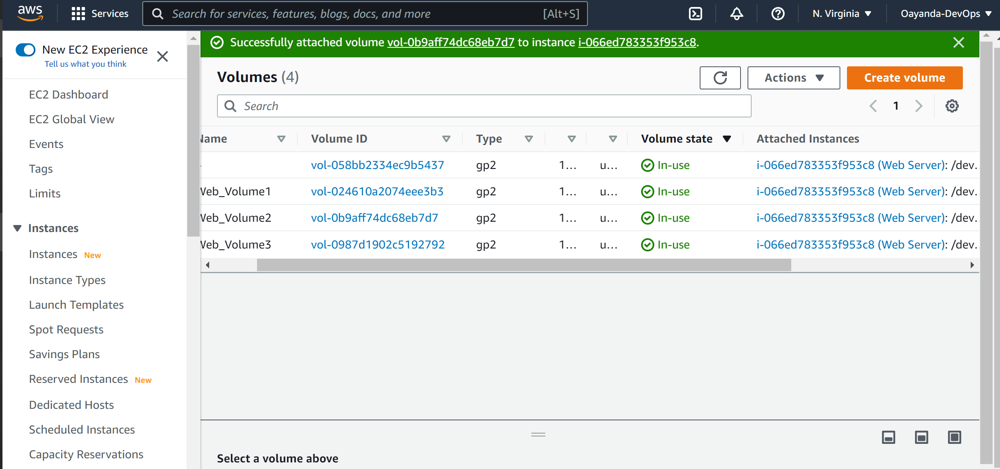

Open up the Linux terminal to begin configuration.
In the linux terminal, verify the volumes as well as the names/labels.
```bash
lsblk
```
```bash
ls /dev | grep xvd
```
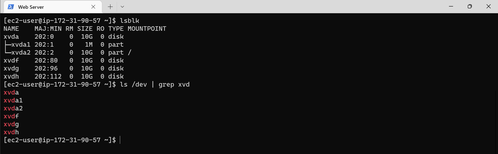
Use df -h command to see all mounts and free space on your server. Notice ***xvd2*** is the only partition visible and this created automatically during the instance creation.
```bash
df -h
```
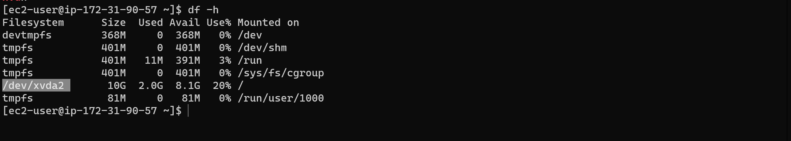
Now, let's use gdisk utility to create a single GPT Linux lvm partition on each of the **3** volumes so that it can be used by the web server instance.

```bash
sudo gdisk /dev/xvdg
```

***Repeat above steps for the remaining 2 volumes.***

Verfiy the partitions are configured as required on each of the 3 disks.
```bash
lsblk
```
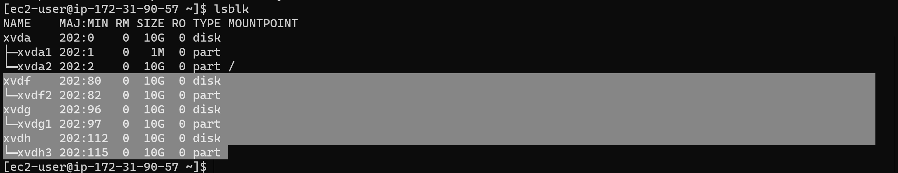
Install lvm2 package using sudo yum install lvm2 - which is a is a device mapper framework that provides logical volume management for the Linux kernel.
```bash
sudo yum install lvm2
```

Run sudo lvmdiskscan command to check for available partitions.
```bash
sudo lvdiskscan
```

Prepare the disks - Use pvcreate utility to mark each of 3 disks as physical volumes (PVs) to be used by LVM.
```bash
sudo pvcreate /dev/xvdf1
sudo pvcreate /dev/xvdg1
sudo pvcreate /dev/xvdh1
```

Verify.
```bash
sudo pvs
```
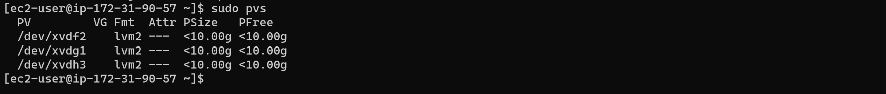
Use vgcreate utility to add all 3 PVs to a volume group (VG). Name the VG webdata-vg and verify.
```bash
sudo vgcreate webdata-vg /dev/xvdh1 /dev/xvdg1 /dev/xvdf1
```
```bash
sudo vgs
```

Create two logical volumns apps-lv (will store Data for the web) and logs-lv(willl store data of logs)
```bash
sudo lvcreate -n apps-lv -L 14G webdata-vg
sudo lvcreate -n logs-lv -L 14G webdata-vg
```
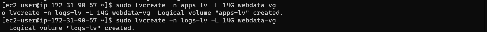
Let's verify the entire setup
```bash
sudo lsblk
```

Use mkfs.ext4 to format the logical volumes with ext4 filesystem
```bash
sudo mkfs -t ext4 /dev/webdata-vg/apps-lv
sudo mkfs -t ext4 /dev/webdata-vg/logs-lv
```

Create /var/www/html directory to store .website files
```bash
sudo mkdir -p /var/www/html
```

Create /home/recovery/logs to store backup of log data.
```bash
sudo mkdir -p /home/recovery/logs
```

Mount /var/www/html on apps-lv logical volume.
```bash
sudo mount /dev/webdata-vg/apps-lv /var/www/html/
```
Use rsync utility to backup all the files in the log directory /var/log into /home/recovery/logs (This is required before mounting the file system)
```bash
sudo rsync -av /var/log/. /home/recovery/logs/
```
Mount /var/log on logs-lv logical volume.
```bash
sudo mount /dev/webdata-vg/logs-lv /var/log
```
Restore log files back into /var/log directory.
```bash
sudo rsync -av /home/recovery/logs/. /var/log
```
Update /etc/fstab file so that the mount configuration will persist after restart of the server.
Check the UUID
```bash
sudo blkid
```
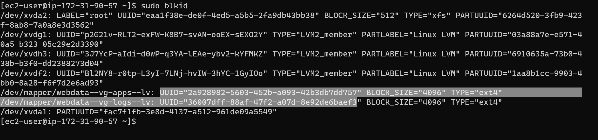
Edit the /etc/fstab/ with the UUID
```bash
sudo nano /etc/fstab/
```

Test the configuration and reload the daemon.
```bash
 sudo mount -a
 sudo systemctl daemon-reload
 ```
 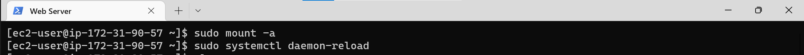
 Verify your setup by running df -h
```bash
df -h
```
 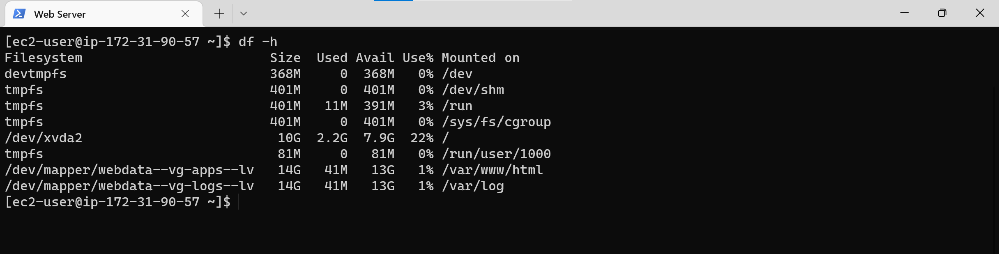

 Prepare the Database Server.
 Lunch another ec2 instance for the Database and attached 3 volumns.
 

Verify volumn creation and attachment.
```bash
lsblk
```
```bash
df -h
```

Create single partitions on all the 3 volumes using the gdisk utility.
```bash
sudo gdisk /dev/xvdf
```
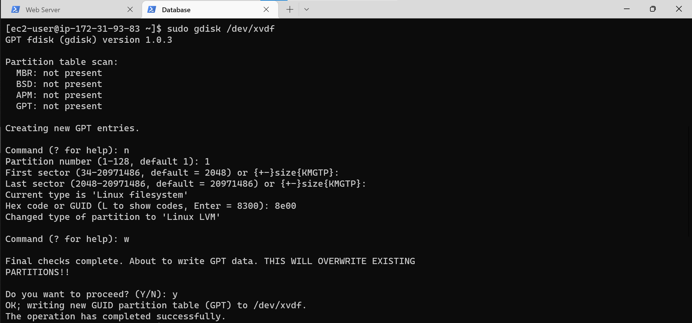
Install lvm2 package
```bash
sudo yum install lvm2
```
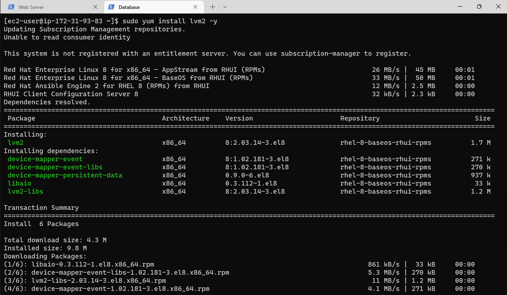
Run sudo lvmdiskscan command to check for available partitions.
```bash
sudo lvmdiskscan
```

Use pvcreate utility to mark each of 3 disks as physical volumes (PVs) to be used by LVM.
```bash
sudo pvcreate /dev/xvdf2
sudo pvcreate /dev/xvdg2
sudo pvcreate /dev/xvdh2
```
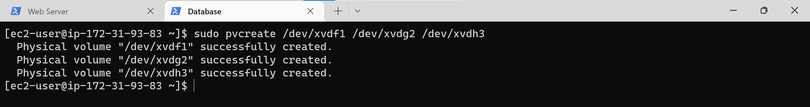
Verify that your Physical volume has been created successfully by running sudo pvs
```bash
sudo pvs
```

Use vgcreate utility to add all 3 PVs to a volume group (VG). Name the VG webdata-vg.
```bash
sudo vgcreate webdata-vg /dev/xvdh2 /dev/xvdg2 /dev/xvdf2
```
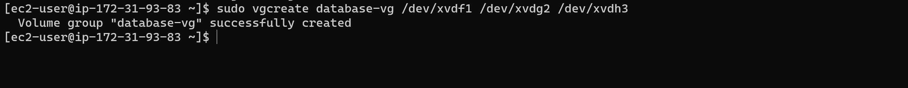
Verify that your VG has been created successfully by running sudo vgs.
```bash
sudo vgs
```

Use lvcreate utility to create 2 logical volumes.
```bash
sudo lvcreate -n db-lv -L 14G webdata-vg
sudo lvcreate -n logs-lv -L 14G webdata-vg
```
```bash
sudo lvs
```

Verify the entire setup
```bash
sudo vgdisplay -v #view complete setup - VG, PV, and LV
sudo lsblk 
```

Use mkfs.ext4 to format the logical volumes with ext4 filesystem
```bash
sudo mkfs -t ext4 /dev/webdata-vg/db-lv
sudo mkfs -t ext4 /dev/webdata-vg/logs-lv
```

Create /db directory to store database files and create /home/recovery/logs to store backup of log data.
```bash
sudo mkdir -p /db
sudo mkdir -p /home/recovery/logs
```
Mount  db-lv logical volume
```bash
sudo mount /dev/webdata-vg/db-lv /db
```
Use rsync utility to backup all the files in the log directory /var/log into /home/recovery/logs
```bash
sudo rsync -av /var/log/. /home/recovery/logs/
```
Mount /var/log on logs-lv logical volume.
```bash
sudo mount /dev/webdata-vg/logs-lv /var/log
```
Restore
```bash
sudo rsync -av /home/recovery/logs/. /var/log
```
Update UUID in /etc/fstab.
View UUID
```bash
sudo blkid
```
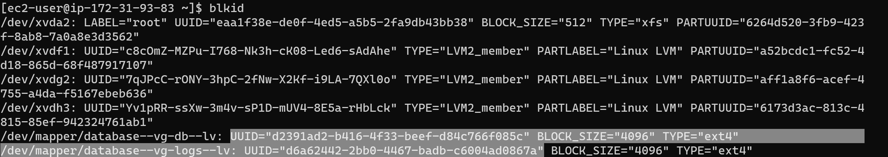
```bash
sudo vi /etc/fstab
```
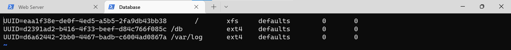
Test the configuration and reload the daemon and verify your setup by running df -h
```bash
 sudo mount -a
 sudo systemctl daemon-reload
 ```
 ```bash
 df -h
 ```
 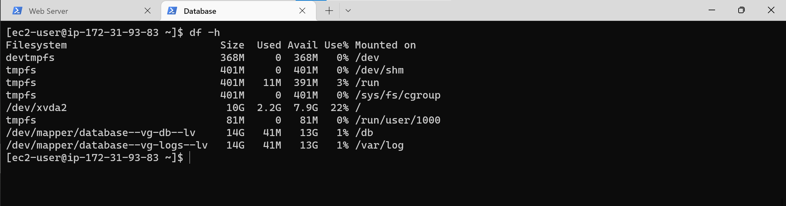

 Install WordPress on your Web Server EC2.
 Update the repository.
 ```bash
 sudo yum -y update
 ```
  

 Install wget, Apache and it’s dependencies.
 ```bash
 sudo yum -y install wget httpd php php-mysqlnd php-fpm php-json
 ```
  
  Start Apache
  ```bash
sudo systemctl enable httpd
sudo systemctl start httpd
  ```
  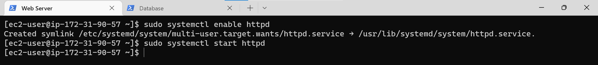
Install PHP and it’s depemdencies.
  ```bash
sudo yum install https://dl.fedoraproject.org/pub/epel/epel-release-latest-8.noarch.rpm
sudo yum install yum-utils http://rpms.remirepo.net/enterprise/remi-release-8.rpm
sudo yum module list php
sudo yum module reset php
sudo yum module enable php:remi-7.4
sudo yum install php php-opcache php-gd php-curl php-mysqlnd
sudo systemctl start php-fpm
sudo systemctl enable php-fpm
setsebool -P httpd_execmem 1
```
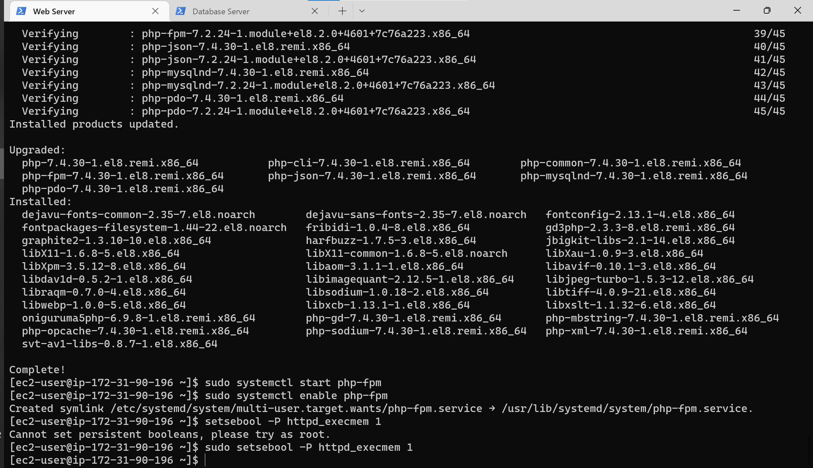 
Restart Apache
```bash
sudo systemctl restart httpd
```
Download wordpress and copy wordpress to var/www/html
```bash
  mkdir wordpress && cd wordpress
  sudo wget http://wordpress.org/latest.tar.gz
  sudo tar xzvf latest.tar.gz
  sudo rm -rf latest.tar.gz
  sudo cp wordpress/wp-config-sample.php wordpress/wp-config.php
  sudo cp -R wordpress /var/www/html/
```
 
Install MySQL on your DB Server EC2.
```bash
sudo yum update
sudo yum install mysql-server
```
Verify that the service is up and running by using sudo systemctl status mysqld, if it is not running, restart the service and enable it so it will be running even after reboot.
```bash
sudo systemctl status mysqld
sudo systemctl restart mysqld
sudo systemctl enable mysqld
```
 

Configure DB to work with WordPress.
```bash
sudo mysql
CREATE DATABASE wordpress;
CREATE USER `myuser`@`<Web-Server-Private-IP-Address>` IDENTIFIED BY 'mypass';
GRANT ALL ON wordpress.* TO 'myuser'@'<Web-Server-Private-IP-Address>';
FLUSH PRIVILEGES;
SHOW DATABASES;
exit
```
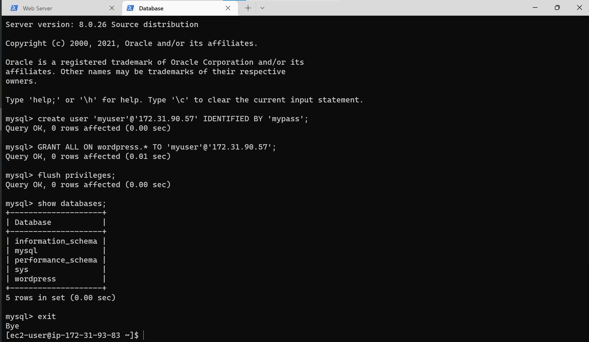
Configure WordPress to connect to remote database.
Make sure database private ip is binded only.

Install MySQL client and test that you can connect from your Web Server to your DB server by using mysql-client